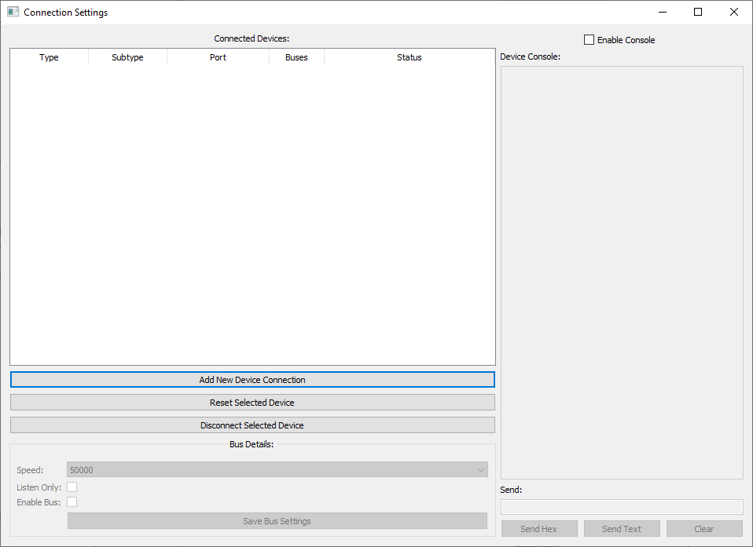

# Quick Start Guide

### Use A0 with Torque


The process of connecting A0 with non-Torque apps should be fairly similar to the the one shown below.


#### Connect via Bluetooth

Using your phone's Bluetooth settings, connect to ELM327-A0.

#### Configure Torque

Enter the settings in Torque, and then the "OBD2 Adapter Settings". Ensure connection type is set to Bluetooth and then select ELM327-A0 under the "Choose Bluetooth Device" option.

#### 

#### Done!

After this point consult the [**Torque Wiki**](https://torque-bhp.com/wiki/Main_Page) to learn how to use Torque.

## Use A0 with SavvyCAN

A0RET allows A0 to work with SavvyCAN via Wi-Fi, no wires needed!

#### Download SavvyCAN

Follow the link below to download the latest release\* of SavvyCAN as a zip archive. Then unzip to a folder.

_\*As of the date of this guide, this version is 1.0.36._



#### Run SavvyCAN

First run vc\_redist.x64.exe to install the Microsoft Visual C++ Redistributable, then run SavvyCAN.exe to open SavvyCAN.

#### Add a Connection

Go to Connection-&gt;Open Connection Window to begin adding a new device.

At this point, plug A0 into the car. Then from the computer running SavvyCAN connect to its Wi-Fi network. The defaults are:

**SSID:** A0RETSSID

**Password:** aBigSecret


These defaults can be changed on lines 89 and 94 of A0RET.ino


Click "Add New Device Connection" and select "Network Connection"; the IP address should pre-populate since we have already connected to A0's network.

You should now start seeing CAN traffic in the main window of SavvyCAN. 

The A0-specific steps have now all been completed and you have free reign in the huge playground that is SavvyCAN, visit their extensive documentation below:



#### For a more detailed look at A0's built in capabilities go to: 



