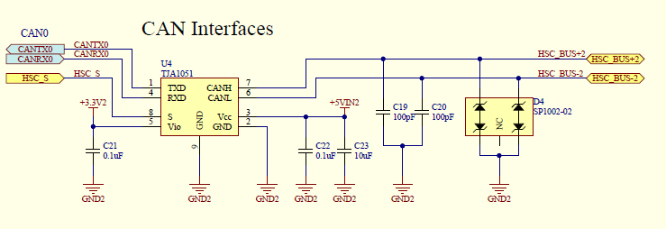

# Automotive Interface

A0 contains both the power supply circuitry and the CAN automotive interface required to communicate with your car.

## CAN 

​[Controller Area Network](https://en.wikipedia.org/wiki/CAN_bus)​

CAN bus is a vehicle bus standard used in most cars built after 2006. It is a message-based protocol that allows modules within a car to communicate with one another. While the physical layer is understood and open, the actual meaning of the messages sent over the bus are not. While some messages are legislated to be "standard", the majority of CAN messages in your typical car are not well documented.

The A0 has 1 CAN channel that can interface directly to the CAN bus network of your car. The A0 uses an external TJA1051 CAN transceiver. Here is CAN interface schematic. Note that C19 and C20 are not populated on shipping hardware. 

Here is the link to the TJA1051 datasheet: [http://www.nxp.com/docs/en/data-sheet/TJA1051.pdf](http://www.nxp.com/docs/en/data-sheet/TJA1051.pdf)​

CAN bus connections can also be found on the 16-pin OBD2 connector.

