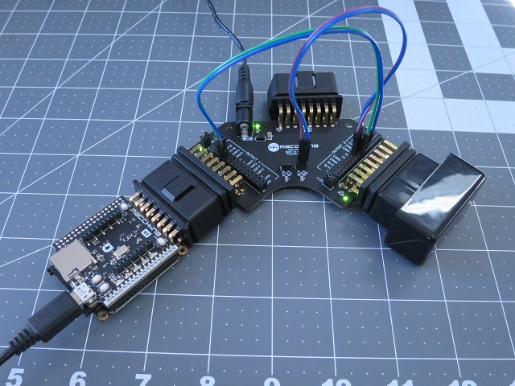
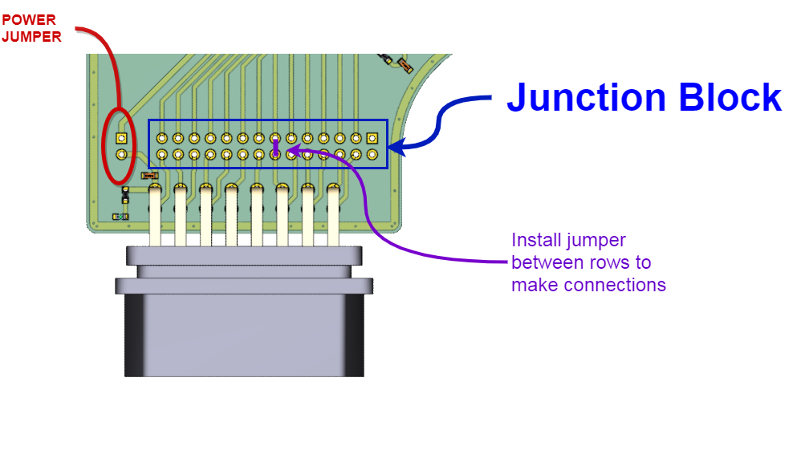
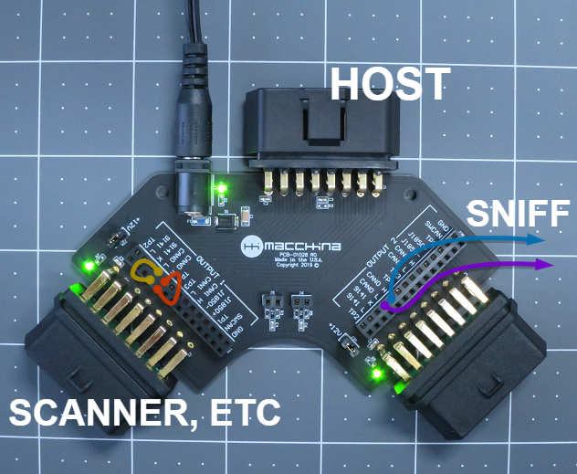

# OBD2 test board - BETA

The OBD2 test board is designed to simplify OBD2 device development. 

## Components

The OBD2 test board has several components as shown below: 

**INPUT OBD2 Connector:** 1 input OBD2 connector \(MALE pins\). This connector would plug into an OBD2 extension cable and eventually into a car's OBD2 port. 

**OUTPUT OBD2 Connectors:** 2 output connectors. \(FEMALE pins\). These connectors are the same as found in any modern car. 

**12V Input power source:** Use in external 12V power adapter when doing desktop OBD2 development. If OBD2 extension cable is used, you'll get power from the car and won't need the external power source. 

**Power jumpers:** Control power to each output by installing Jumpers. GREEN LED confirms power is ON. 

**Junction blocks:** Route OBD2 signals to the connectors as needed. All signals are broken out and available. More about Junction block functionality below. 

**CAN termination resistors:** 2 sets of termination resistors are available. These are typically used when using an emulator. 

## Junction blocks

The junction blocks near both OUTPUT OBD2 connector gives you the flexibility to change how signals move between connectors. Install a jumper wire between rows to make "through" connections, or jump over to other pins to rearrange signals. 


Warning - be careful when rearranging signals between OBD2 connectors. Not all pins have same voltage levels. 


The row closest to the OBD2 connector goes directly to the connector. 

The row farthest from the OBD2 connector goes directly to the INPUT OBD2 connector.  

Note: Ground is already connected between the 3 OBD2 connects, but also available on junction blocks for convenience. 

## Modes

The OBD2 test board can function in several "modes" by rearranging how the signals route throughout the board. For example: 

#### 1. Sniffer:

This mode allows you to use external test equipment to watch traffic. In the example below, the CAN0 channel is being "Sniffed". 

#### 2. Man in the middle:

Put an OBD2 device \(i.e. M2\) in between the host and another OBD2 device \(i.e. OEM scanner, etc\).  This mode gets its name from the computer security term. Learn more here: 



In our case, if we wanted to intercept, change or better understand a CAN conversation, we'd use the connections shown below. The CAN traffic _to_ and _from_ "Scanner" would need to go _though_ our device \(shown in the middle as "man" below\). 

#### 3. Emulator:

Connect 2 OBD2 dongles together for desktop development purposes. Typically, one of the devices would be set up to be an Emulator and the other a scanner, etc. In many cases, you'd need to ensure the CAN bus is terminated as shown below

#### 4. Other:

The OBD2 test board has several modes and many configurations - all of which can be made using standard jumper wires. For example, breakout or splitter modes are easy to do with the OBD2 test board. 

**5. Schematics and board files:**

We've put the schematics and board files into a Github repo. Feel free to create an issue with suggestions, bugs, etc. here: 



